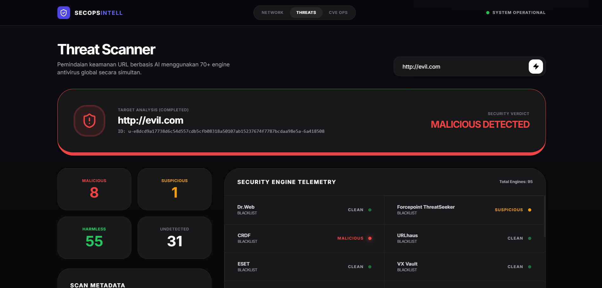
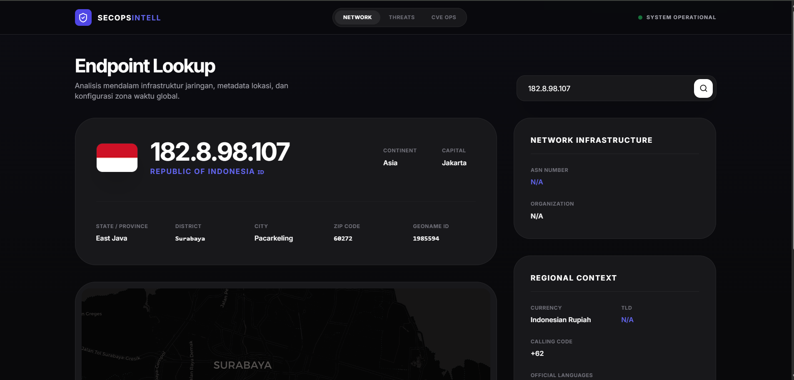
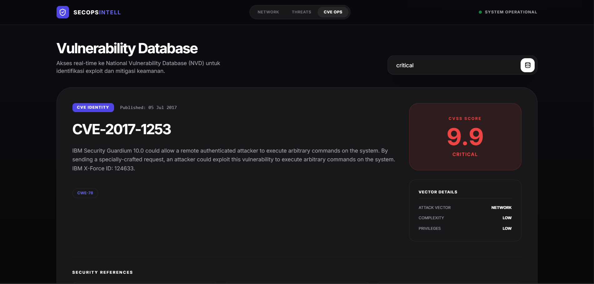
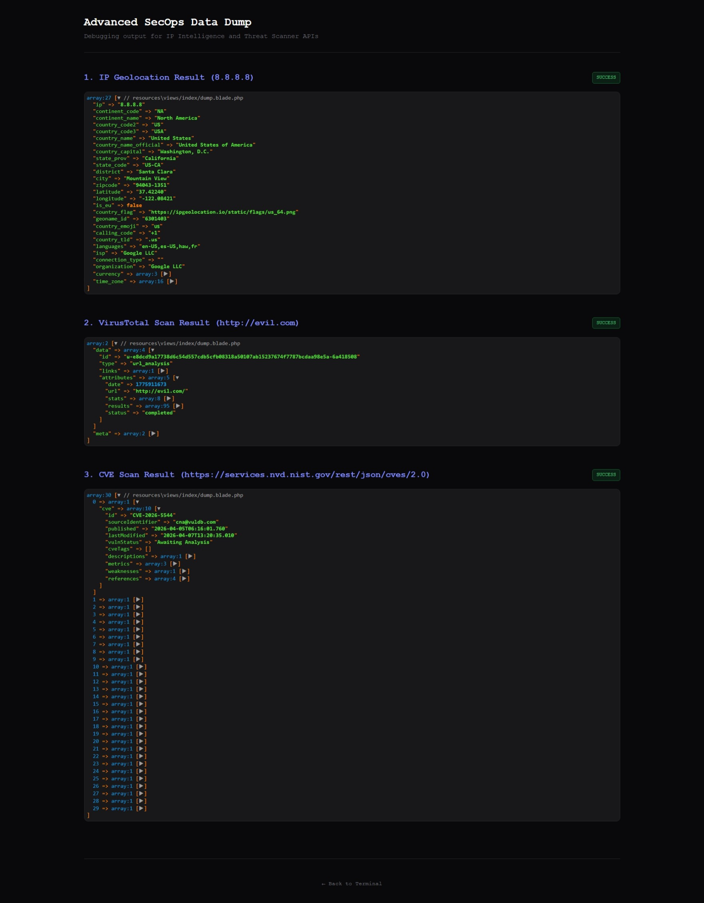

# SecOps Intelligence

**SecOps Intelligence** adalah tugas Integrasi Aplikasi Enterprise bagian memanfaatkan API Public, dan saya membuat dengan tujuan untuk investigasi infrastruktur jaringan, audit keamanan IP, serta pemantauan kerentanan (CVE) secara real-time.

---

## Screenshots

<div align="center">
  
  <p style="font-weight: bold;">Tampilan Fitur URL Scan</p>
</div>

<br>

<div align="center">
  <table>
    <tr>
      <td></td>
      <td></td>
    </tr>
    <tr>
      <td align="center"><b>IP Geolocation Analysis</b></td>
      <td align="center"><b>NVD CVE Database</b></td>
    </tr>
  </table>
</div>

---

## Data Dump

<div align="center">
  
  <p style="font-weight: bold;">Tampilan Data Dump dari semua API Public</p>
</div>

---

## Fitur Utama

### 1. **URL & Domain Security Scanner**

Menganalisa domain atau URL untuk mengetahui apakah sebuah website terdeteksi berbahaya atau aman.

### 2. **Advanced IP Geolocation**

Melacak lokasi fisik dan informasi teknis dari alamat IP.

- **Geospasial**: Negara, Kota, Kode Pos, dan Koordinat (Lat/Long).
- **Timezone**: Waktu lokal di lokasi IP tersebut berada.

### 3. **Real-time CVE Explorer (NVD Integration)**

Terhubung langsung dengan database **NVD (National Vulnerability Database)** dari NIST.

- **Search by ID**: Mencari detail spesifik kerentanan menggunakan kode CVE (contoh: `CVE-2023-44487`).
- **Filter by Severity**: Menampilkan daftar kerentanan terbaru berdasarkan tingkat bahaya: `LOW`, `MEDIUM`, `HIGH`, dan `CRITICAL`.
- **Auto-Discovery**: Secara otomatis menampilkan 30 kerentanan terbaru yang diterbitkan dalam 7 hari terakhir jika tidak ada input pencarian.

---

## Alur Kerja Aplikasi (Application Flow)

Aplikasi beroperasi dengan alur kerja sebagai berikut:

1.  **Input Phase**: User memasukkan data melalui form (URL, IP, atau Kode CVE/Severity).
2.  **Controller Logic (`IPGeo.php`)**:
    - Request ditangkap oleh Controller.
    - Untuk **IP/Scan**: Sistem melakukan query ke API pihak ketiga (ipgeolocation.io) dan (virustotal.com).
    - Untuk **CVE**: Sistem menentukan apakah input adalah ID CVE atau Keyword Severity.
3.  **API Integration**:
    - Aplikasi berkomunikasi dengan REST API luar menggunakan Laravel HTTP Client.
    - Implementasi _timeout_ dan _retry_ logic untuk menjamin stabilitas koneksi.
4.  **Data Processing**:
    - Data JSON dari API diproses dan dibersihkan.
    - Khusus untuk CVE Severity, dilakukan optimasi `array_reverse` dan `array_slice` untuk memastikan hanya 30 data terbaru yang ditampilkan agar performa browser tetap terjaga.
5.  **View Rendering**: Data dikirim ke Blade Template (`ipgeo.blade.php`) dan ditampilkan menggunakan framework CSS Tailwind untuk antarmuka yang modern dan responsif.

---

## Teknologi yang Digunakan

- **Backend**: Laravel 12 (PHP 8.2+)
- **Frontend**: Blade Template, TailwindCSS, Lucide Icons
- **APIs**:
    - [VIRUS TOTAL](https://www.virustotal.com/gui/home/upload) (Virus Total API)
    - [NVD NIST API](https://nvd.nist.gov/developers/v2) (Vulnerability Data)
    - [IP-API](https://api.ipgeolocation.io/ipgeo) (Geolocation Data)
- **Library**: GuzzleHttp / Laravel HTTP Client, Carbon (Time Manipulation)

---

## Instalasi

1. **Clone Repositori**

    ```bash
    git clone https://github.com/AdliXSec/SecOpsIntell
    cd SecOpsIntell
    ```

2. **Instalasi Dependency**

    ```bash
    composer install
    ```

3. **Konfigurasi Environment**

    ```bash
    cp .env.example .env
    php artisan key:generate
    ```

4. **Menjalankan Server**
    ```bash
    php artisan serve
    ```

---

<p align="center">Dibuat dengan ❤️ Tugas IAE (Integrasi Aplikasi Enterprise)</p>
